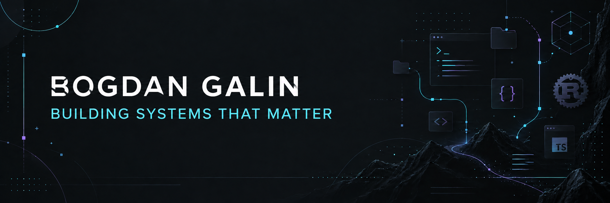

# Bogdan Galin · `Nopass0`

### Software engineer building useful systems at the edge of code, tooling and infrastructure

 

> I like turning difficult, low-level problems into tools that feel simple to use.
> My work moves between web platforms, Rust utilities, automation and developer-focused experiments.

## What I build

| Area | Focus |
| --- | --- |
| **Web systems** | TypeScript, Node.js, file management, notification and business tooling |
| **Rust tooling** | Fast command-line utilities, networking and performance-oriented software |
| **Developer experience** | Practical automation, clean interfaces and tools that remove friction |
| **Product experiments** | Small focused products, prototypes and visual web experiences |

## Selected work

<table>
<tr>
<td width="50%">

### [dev_manager](https://github.com/Nopass0/dev_manager)
Unified Rust + tree-sitter manager for microservices orchestration, Git automation, code analysis and deployment.

</td>
<td width="50%">

### [NetFolders](https://github.com/Nopass0/netfolders)
Secure TypeScript / Node.js file server and management system for uploading, storing and organizing files.

</td>
</tr>
<tr>
<td width="50%">

### [dirb_rust](https://github.com/Nopass0/dirb_rust)
Fast Rust-based directory brute-force utility focused on speed and a lean command-line workflow.

</td>
<td width="50%">

### [Notihabr](https://github.com/Nopass0/notihabr)
An automation-oriented TypeScript project for collecting and working with useful content.

</td>
</tr>
<tr>
<td width="50%">

### [Onomics](https://github.com/Nopass0/onomics)
An experimental TypeScript product exploring practical tools for everyday workflows.

</td>
<td width="50%"></td>
</tr>
</table>

## Toolbox

## GitHub activity

### Build something meaningful.

Open to interesting engineering problems, thoughtful collaborations and ambitious experiments.

